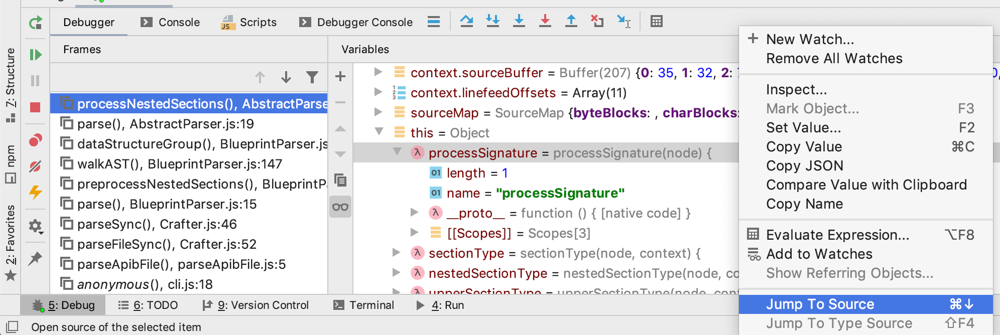

## Отладка Crafter

При работе над той или иной функциональностью в Crafter разработчик неизбежно сталкивается с разного
рода ошибками, которые необходимо идентифицировать и исправить.

Для разбора ошибок можно использовать различные техники. Чаще всего применяют отладочный вывод и
отладчик (debugger).

Отладочный вывод - добавление в разные части программы инструкций `console.log`, позволяющих
разработчику лучше понять что именно происходит в тот или иной момент и на основе этого сделать
вывод о причине бага.

Отладчик - приложение, позволяющее останавливать выполнение программы в определенный момент,
производить выполнение программы по шагам и просматривать значение различных переменных.

Далее по тексту предполагается, что разработчик использует среду программирования
[WebStorm](https://www.jetbrains.com/webstorm/). Для других приложений (VS Code, Sublime Text, Vim и
т.п.) наверняка есть похожие режимы, но их рассмотрение выходит за пределы данного документа. О том,
как происходит отладка Node.js приложений в среде WebStorm можно прочитать в
[официальной документации](https://www.jetbrains.com/help/webstorm/running-and-debugging-node-js.html).

По внешнему виду ошибки можно разделить на две группы:

* ошибки JavaScript;
* несоответствие ожидаемого и фактического результата.

Рассмотрим каждую из групп подробнее.

### Ошибки JavaScript

Ошибки JavaScript проявляются в виде сообщений вида `undefined is not a function`,
`cannot read property y of undefined` и подобных. Специфика JavaScript ошибок в том, что всегда
можно посмотреть где данная ошибка произошла. Для этого необходимо запустить Crafter с флагом `-d`,
при этом будет включен отладочный режим, когда при возникновении ошибки происходит выход из
программы с печатью стека вызовов (stacktrace). Зная где произошла ошибка становится возможным
понять почему данная ошибка произошла и как ее исправить.

Например, в случае сообщения `cannot read property y of undefined` скорее всего происходит попытка
вызова метода у объекта, который, по каким-то причинам отсутствует. Возможно функция, которая
генерирует данный объект вернула `null` или `undefined`, возможно в одном из блоков `if` забыли
присвоить значение объекту или же цикл завершился раньше, чем должен был и поэтому инициализация
объекта не произошла.

В случае возникновения ошибки JavaScript рекомендуется использовать отладчик (debugger): точка
останова (breakpoint) ставится чуть выше места возникновения ошибки и при этом появляется
возможность посмотреть значения локальных переменных, выполнить программу по шагам и тем самым
приблизиться к пониманию причин возникновения ошибки и как следствие устранению ошибки.

### Несоответствие ожидаемого и фактического результата (логические ошибки)

Другая разновидность ошибок - ситуация, когда ошибки JavaScript отсутствуют, но при этом в
результате парсинга получается совершенно не тот результат, которого ожидает разработчик. Возможны
несколько типичных причин такого поведения:

* одна из секций не была распознана и Crafter пропустил ее: в этом случае чаще всего будет
  отображаться сообщение вида `Ignoring unrecognized block`;
* секция была распознана как описание, вместо секции с данными: определить данную проблему можно по
  наличию блока `copy` в результате;
* секция была распознана неправильно: в результате парсинга секция имеет другой тип, например,
  вместо `dataStructure` - `httpTransaction`;
* JSON Schema отсутствует, не валидна или выглядит не так как ожидается;
* Body отсутствует или выглядит не так как ожидается.

В отличие от ошибок JavaScript, в случае логических ошибок неочевидно откуда начинать отладку.
Разбор ошибок на больших документациях достаточно неудобен, поэтому для того, чтобы разобраться в
причинах возникновения ошибки и устранить их сначала необходимо подготовить минимальный
воспроизводящий пример файла `.apib`. Такой пример можно сделать путем последовательного удаления
блоков не относящихся к непосредственной ошибке. Можно использовать метод половинного деления:
удаляем половину секций, проверяем, сохранилась ли ошибка. Если ошибка сохранилась - удаляем
половину из оставшихся блоков, если нет - возвращаем удаленные блоки и удаляем другую половину.

После того как минимальный пример подготовлен можно начинать поиск и устранение ошибки.

Рассмотрим каждый из описанных выше случаев подробнее.

#### Секция не распознана

Каждая секция в Crafter обрабатывается своим парсером из директории `parsers`. Каждый парсер
действует по следующему алгоритму (подробнее см. [algorithm.md](algorithm.md)):

* обработать сигнаруру;
* обработать описание;
* обработать вложенные секции.

Вложенные секции обрабатываются следующим образом:

* вызвать метод `nestedSectionType`;
* если `nestedSectionType` вернул значение отличное от `undefined` - запустить
  `processNestedSection`;
* если `nestedSectionType` вернул `undefined` - проверить, валидна ли такая секция в данном
  контексте с помощью метода `isUnexpectedNode` и если нет - пропустить ее.

Если секция не распозналась - значит в какой-то момент один из парсеров вернул `undefined` из метода
`nestedSectionType`. Нужно разобраться почему так произошло. Для этого ставим точку останова в
[AbstractParser.js](../parsers/AbstractParser.js) в методе `processNestedSections` рядом с
генерацией предупреждения о нераспознанной секции, а после этого смотрим где определена функция
`processSignature` и понимаем в каком парсере находимся:



После этого можно исследовать метод `nestedSectionType` целевого парсера и пытаться понять что пошло
не так.

#### Секция распознана как описание

Большинство парсеров используют для разбора описания функцию `processDescription` из
[AbstractParser](../parsers/AbstractParser.js), поэтому для того, чтобы понять почему лишняя секция
попала в описание рекомендуется добавить точку останова в эту функцию и запустить парсер в режиме
отладки. Возможно дело не в Crafter, а в корректности самой документации, например, если при
написании секции `Body` забыть поставить пустую строку то весь блок будет распознан как описание:

```markdown
+ Body
            Hello world
```

#### Секция распознана неправильно

Для того, чтобы понять почему та или иная секция была распознана неправильно для начала необходимо
определить в какой момент все пошло не так как нужно. Для этого добавляем точку останова в
[BlueprintParser](../parsers/BlueprintParser.js) в конец метода `parse` и проверяем какое AST
получилось. После этого пытаемся найти секцию до ошибочной, определяем какой парсер ее разбирал (для
этого смотрим название секции и поиском по проекту проверяем какой из парсеров такую секцию создает)
и добавляем точку останова в найденный парсер и разбираемся почему секция распозналась неправильно.

Часто встречающиеся причины такой ошибки:

* часть секции распозналась как `description` и парсер пытается обработать оставшуюся часть с
  середины;
* опечатка в функции `processNestedSection`.

#### Проблемы с JSON Schema

Генерация JSON Schema происходит с помощью рекурсивного вызова функции `getSchema` в функции
`finalize` в [ResponseParser](../parsers/ResponseParser.js) и
[RequestParser](../parsers/RequestParser.js), поэтому в случае проблем необходимо поставить точку
останова в `finalize` и двигаться вглубь.

Нужно помнить, что если у элемента `Request` или `Response` есть вложенная секция `Schema`, то
генерация JSON Schema запускаться не будет.

#### Проблемы с Body

Генерация Body происходит с помощью рекурсивного вызова функции `getBody` в функции `finalize` в
[ResponseParser](../parsers/ResponseParser.js) и [RequestParser](../parsers/RequestParser.js),
поэтому в случае проблем необходимо поставить точку останова в `finalize` и двигаться вглубь.

Нужно помнить, что если у элемента `Request` или `Response` есть вложенная секция `Body`, то
генерация JSON Schema запускаться не будет.

### Тесты

После отладки той или иной ошибки необходимо добавить тест, который позволит быть уверенным в том,
что ошибка не всплывет вновь. Для этого нужно поместить тест в директорию `tests/fixtures` и
запустить скрипт `npm run regenerate-fixtures`. Данный скрипт сгенерирует необходимые для работы
теста json-файлы. Если в результате запуска скрипт кроме новых файлов изменятся существующие, то
нужно посмотреть изменения вручную и понять не поломалась ли какая-то существующая функциональность.
